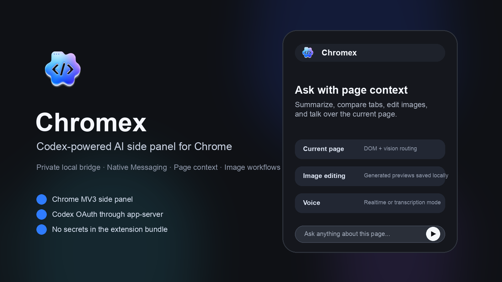
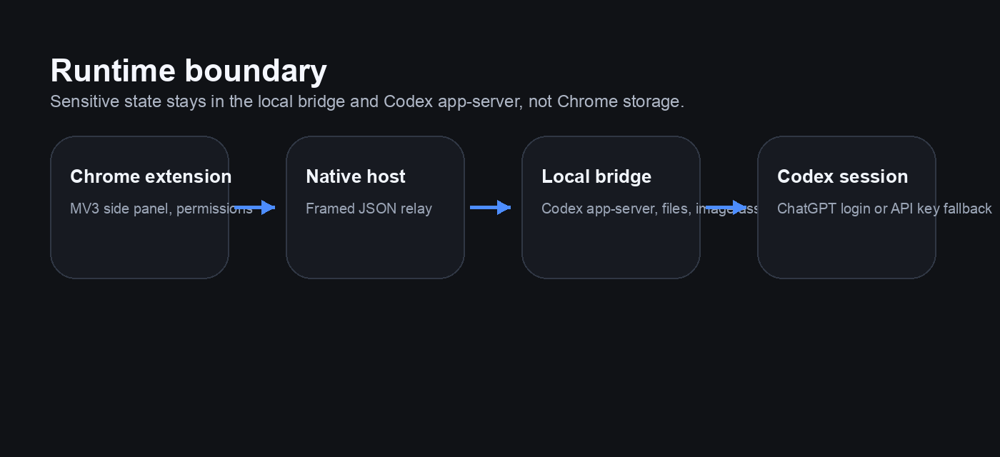

# Chromex



Chromex is a Chrome MV3 side-panel agent that connects Chrome to Codex through a local native bridge. It is designed for public installs: browser code stays lightweight, credentials stay out of extension storage, and powerful capabilities such as page reading, history search, microphone access, screen capture, and browser control are requested only when the user asks for that workflow.

[](https://github.com/GENEXIS-AI/chromex/actions/workflows/ci.yml)
[](./LICENSE)

## What It Does

- Chat with the current page, selected tabs, uploaded files, screenshots, images, PDFs, Office files, and browser history.
- Edit or generate images through the Codex image workflow while keeping outputs non-destructive and locally saved.
- Use realtime voice, voice transcription, page-aware suggestions, custom profiles, Codex skills, and site adapters.
- Summarize YouTube videos with timestamp context, work with news/research/PDF/arXiv pages, and route image/file/page requests automatically.
- Run browser-control workflows through the extension/content-script boundary with visible in-page activity indicators.

## Install In 5 Minutes

Prerequisites:

- Chrome or Chromium 116+
- Node.js 20+ for local build/install scripts
- A local `codex` binary available on `PATH` or in a common install location
- ChatGPT/Codex login, or API-key fallback handled by the local app-server flow

```bash
git clone https://github.com/GENEXIS-AI/chromex.git
cd chromex
npm install
npm run build
node scripts/install-native-host.mjs
```

Then open `chrome://extensions`, enable Developer Mode, choose **Load unpacked**, and select:

```text
packages/extension/dist
```

Open Chromex from the Chrome toolbar or side panel, sign in with ChatGPT/Codex, and use **Workspace > System check** if the native bridge or Codex binary needs diagnosis.

## Runtime Boundary



## Architecture

`Chrome Extension -> Native Messaging Host -> Local Bridge -> codex app-server`

The runtime is split into four workspaces:

- `packages/extension`: Chrome MV3 extension
- `packages/bridge`: local bridge daemon for Codex App Server and multimodal planes
- `packages/native-host`: Chrome Native Messaging relay
- `packages/shared`: shared contracts, policies, profiles, and helpers

## Security-First Defaults

- No private signing key or developer-only extension secret is required in source control.
- The extension keeps `history`, `tabs`, and screen/site access behind runtime permission prompts.
- The extension does not store raw auth tokens or API keys in extension storage.
- Codex OAuth/ChatGPT managed login through `codex app-server` is the default auth path.
- The native-host installer does not copy `OPENAI_API_KEY` into a file during setup.
- Conversation history is session-only by default. Persistent local chat history is opt-in in Workspace settings.
- Native host child processes and workspace hooks run with a reduced environment allowlist instead of inheriting the full shell environment.
- The side panel auto-detects the Codex binary from `PATH` and common install locations instead of requiring a manual path in the UI.
- Release candidates can be checked with `npm run release:audit` before pushing.

More detail is in [SECURITY.md](./SECURITY.md).

## Features

- persistent MV3 side panel with chat-first UX
- current-page, image, history, and file context routed automatically from user intent
- `@open-tabs` picker for selecting one or more open tabs without leaving the composer
- `/` profile picker with searchable professional profiles
- chat attachment support for images, text, PDF, DOCX, CSV, TSV, XLSX, and XLSM
- mixed routing for `current page + uploaded files` with automatic profile/model/read-strategy selection
- Codex skills loaded from `.codex/skills/*/SKILL.md` and injected only when enabled in context settings
- legacy commands loaded from `.codex/commands/*.md`
- read strategy policy: `dom`, `vision`, `hybrid`, `adapter`
- built-in profile templates for research, fact checking, strategy, product, marketing, sales, legal review, teaching, data analysis, UX, writing, support, HR, finance, communications, and critique workflows
- YouTube adapter with current timestamp context and seek actions
- YouTube-specific suggested questions generated from the current video title, channel, timestamp, and chapters
- recent chats with local session persistence and optional device persistence
- pop-out and dock-back chat window flow
- live voice captions and page navigation commands
- non-destructive image editing for the current image or visible tab
- native-host bridge boundary so credentials do not live in extension storage
- Codex workspace harness:
  - `CODEX.md`
  - `.codex/settings.json`
  - `.codex/settings.local.json`
  - `.codex/rules/**/*.md`
  - `.codex/skills/*/SKILL.md`
  - `.codex/commands/*.md`

## Development

1. `npm install`
2. `npm run typecheck`
3. `npm run test`
4. `npm run build`
5. `npm run release:audit`
6. Optional browser smoke test:
   - `npm run smoke`
   - or install the browser once first with `npm run smoke:install-browser`

The built extension is emitted to `packages/extension/dist`.

The current manifest sets `"minimum_chrome_version": "116"` because the extension uses `chrome.sidePanel.open()`.

The smoke test launches the unpacked extension in an isolated persistent Chromium profile using Playwright's recommended MV3 flow. It prefers:

- `PLAYWRIGHT_CHANNEL` when you want a specific Playwright browser channel
- `BROWSER_EXECUTABLE_PATH` when you want a specific local browser binary
- a Playwright-installed Chromium from the local `ms-playwright` cache
- a system Chrome for Testing or Chromium install

If no compatible browser is present, `npm run smoke` can bootstrap Playwright Chromium automatically. Google Chrome and Microsoft Edge branded builds are intentionally excluded here because they no longer support this command-line side-loading workflow.

Environment flags:

- `SMOKE_INSTALL_BROWSER=0 npm run smoke` to skip the automatic browser install path
- `SMOKE_HEADLESS=false npm run smoke` to run the smoke test with a visible browser window
- `PLAYWRIGHT_CHANNEL=chromium npm run smoke` if you want Playwright to pick the bundled Chromium channel directly

## Local Install

1. Build everything with `npm run build`.
2. In Chrome, open `chrome://extensions`.
3. Enable Developer Mode.
4. Load unpacked extension from `packages/extension/dist`.
5. Install the native messaging host with `node scripts/install-native-host.mjs`.
6. Open the extension side panel.
7. Check `Workspace > System check` to confirm the native host and Codex binary were detected automatically.
8. If the status looks stale, use `Reconnect`.

After local code changes, run `npm run build`, then reload the unpacked extension in `chrome://extensions`. The build injects a fresh asset version into `sidepanel.html`, so a Chrome extension reload is enough to pick up the latest `sidepanel.js` and `sidepanel.css`. If changes still do not appear, run `npm run diagnose:extension` and confirm Chrome is loading `packages/extension/dist`, not an older copied folder. If Chrome is intentionally loading a copied unpacked folder, run `npm run sync:extension`, then reload the extension card in `chrome://extensions`.

If model loading fails, check `Workspace > Connection` first. The panel now separates:

- native host setup problems, such as missing installation or extension-id mismatch
- Codex binary auto-detection problems
- account or model-catalog problems after the local bridge is already connected

The manifest includes a stable public key, so the installer can derive the unpacked extension ID automatically. If you need to override it manually, you can still run `node scripts/install-native-host.mjs <EXTENSION_ID>`.

## Chrome Web Store Package

Create an upload-ready extension zip from the repository root:

```bash
npm run package:webstore
```

This command rebuilds the extension, stages `packages/extension/dist`, removes the public unpacked-install `manifest.key`, strips source maps and local build metadata, validates the zip contents, and writes the package to `output/chrome-web-store/`. Zip creation is implemented in Node so contributors do not need platform-specific `zip` or `unzip` binaries.

Useful installer flags:

- `--browser=chrome,chrome-beta,chrome-dev,chrome-canary,chrome-for-testing,chromium`
- `--profile-dir=/path/to/custom/profile`
- `--include-legacy-extension-ids` to preserve access for older unpacked extension IDs during migration

Default install targets:

- macOS: Google Chrome Stable/Beta/Dev/Canary, Chrome for Testing, and Chromium user-level native messaging directories
- Linux: Google Chrome Stable/Beta/Unstable, Chrome for Testing, Chromium, and chromium-browser user-level native messaging directories
- Windows: current-user Google Chrome Stable/Beta/Dev/Canary native messaging registry keys and manifests

The installer validates the extension ID, uses official native messaging locations for the current OS, and never copies an API key into local files during setup. By default it allows only the current extension ID plus compatible IDs discovered from local Chrome profiles; legacy IDs require the explicit migration flag above.

Runtime files use per-user OS locations: macOS stores bridge data under `~/Library/Application Support/CodexSidepanel`, Windows under `%LOCALAPPDATA%\\CodexSidepanel`, and Linux under XDG config/data directories. Workspace-generated images stay under `<workspace>/.codex-sidepanel/generated-images` when a workspace is active.

## For Public Users

Chromex is intentionally source-installable. A normal user should only need the commands in **Install In 5 Minutes**, one Chrome unpacked-extension load, and the native host installer.

What is local:

- ChatGPT/Codex OAuth state and API-key fallback are owned by `codex app-server` and the local bridge.
- Generated image originals and temporary uploads are stored in local per-user/workspace folders.
- Saved settings and optional chat history stay in Chrome local storage or session storage.

What is not bundled:

- No developer API key
- No Chrome Web Store signing key
- No generated native-host manifest
- No private local Codex auth files
- No generated images from the maintainer machine

## Runtime Prerequisites

- `codex` should be available on `PATH` or installed in a common system location so the side panel can detect it automatically.
- Codex OAuth/ChatGPT login flows are handled through `codex app-server`.
- ChatGPT login is enough for the default Codex image-edit flow.
- API key login remains an optional fallback path.

## Workspace Harness

The bridge supports a Codex workspace harness for repeatable project behavior:

- `CODEX.md`: project memory and persistent instructions
- `.codex/settings.json`: shared permission mode and hook configuration
- `.codex/settings.local.json`: local overrides that should stay uncommitted
- `.codex/rules/**/*.md`: scoped rules loaded into prompt context
- `.codex/skills/*/SKILL.md`: reusable slash shortcuts
- `.codex/commands/*.md`: legacy command shortcuts that still appear in the slash menu

This repository includes a minimal seed harness under `.codex/` so the feature works immediately when you load the extension from this workspace.

## Open-Source Hygiene

- Do not commit native-host manifests, `__load_extension__*.pem`, `__load_extension__.crx`, `node_modules`, or build outputs.
- Keep `.codex/settings.local.json` local-only.
- Run `npm run release:audit` before any public push.
- Review [SECURITY.md](./SECURITY.md) before publishing or accepting outside contributions.
- Follow the [open-source release checklist](./docs/open-source-release-checklist.md) for source backups, secret review, and verification.
- CI is wired for `macos`, `ubuntu`, and `windows` with `typecheck`, `test`, `build`, `audit`, and unpacked-extension smoke coverage.

## Troubleshooting

- **Native host missing or forbidden**: run `npm run build`, then `node scripts/install-native-host.mjs`, reload the extension in `chrome://extensions`, and check **Workspace > System check**.
- **Model list does not load**: confirm the bridge is connected first, then sign in through the app-server-backed login flow.
- **Page context is unavailable**: open Chromex from the target tab or approve the Chrome site permission prompt when the workflow requests page access.
- **Chrome still shows old UI**: run `npm run build`, reload the extension card, and use `npm run diagnose:extension` to ensure Chrome is loading `packages/extension/dist`.
- **Browser smoke test fails because no browser exists**: run `npm run smoke:install-browser`, then `npm run smoke`.

## Notes

- Voice UX uses a Codex app-server realtime session. The side panel owns the microphone/WebRTC offer, bounded reconnect, and transcript UI, while the bridge owns `thread/realtime/start`, SDP answer events, transcript events, and cleanup.
- The bridge forwards screenshot/image context as actual Codex image inputs instead of flattening vision context into plain text.
- Installed and enabled Codex plugins are exposed as `plugin://name@marketplace` structured mentions from the `@` picker.
- Uploaded files are ephemeral in the side panel and are not persisted with saved conversations. Images are sent as multimodal inputs, while non-image files are parsed locally into compact prompt context.
- Arbitrary write-back automation into third-party websites is intentionally out of scope for v1.

## Design Docs

- [docs/architecture.md](./docs/architecture.md)
- [docs/browser-ai-parity.md](./docs/browser-ai-parity.md)
- [docs/gemini-in-chrome-gap-analysis.md](./docs/gemini-in-chrome-gap-analysis.md)
- [docs/codex-app-server-gap-analysis.md](./docs/codex-app-server-gap-analysis.md)
- [docs/attachment-routing-architecture.md](./docs/attachment-routing-architecture.md)
- [docs/open-source-release-checklist.md](./docs/open-source-release-checklist.md)

## License

MIT. See [LICENSE](./LICENSE).
